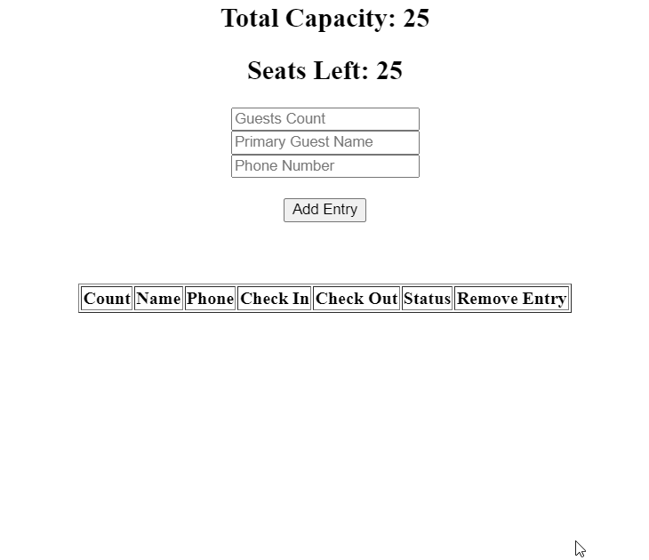

CMT (Mini Project)

Create a React App to maintain the records of the customers.
Create a form to get the details of the customers, like the guest count, name, and phone number.
Complete the table to show the records of the customers as shown in the output.
When the form is submitted, then "Seats Left" should decrease by the guest count, and a new entry should appear at the top of the table having a blank "Check Out" column and the status should show "Click to Checkout".
After clicking on "Click to Checkout", the user should be checked out, and the "Check Out" column should show the current timestamp as the checkout time. Also, "Seats Left" should increase the guest count.
Clicking on "Delete" in the "Remove Entry" column should delete the record. If it's already checked out and when delete is clicked, then "Seats Left" should not increase, but if the record is deleted before checking out, then "Seats Left" should increase by the guest count.
When the count of guest exceeds "Seats Left" show an alert with the message "Guest count exceeds capacity". Also the "Seats Left" should never exceed "Total Capacity" or have a negative value.
Optionally handle duplicate name entries by showing an alert with the message "Customer already exists" when someone tries to add an entry with a name that already exists in the records table.
Expected Output:

